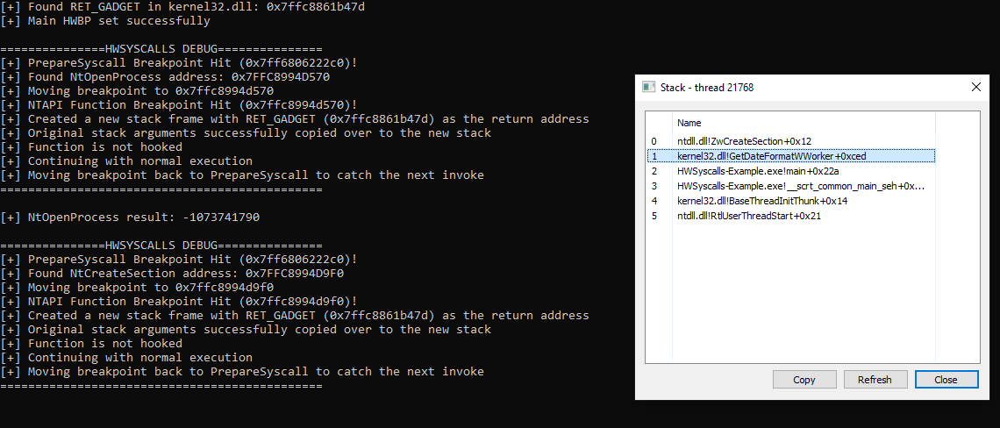
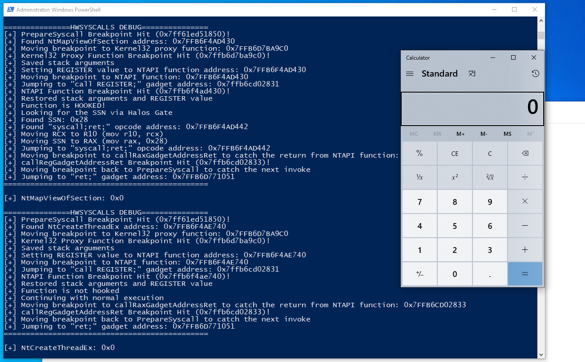

# HWSyscalls

 

## This project was co-authored by

[](https://github.com/Dec0ne) [](https://github.com/idov31)

## Description

HWSyscalls is a new method to execute indirect syscalls using 3 main components:

- Hardware breakpoints and Vectored Exception Handler to control the flow of execution.

- HalosGate is used to find syscall numbers and addresses.

- Creating a synthetic trampoline on kernel32 with hardware breakpoints.

HWSyscalls is provided as an easy-to-include library that can be added to any project that wants to use indirect syscalls without triggering EDRs or AVs detections based on the current indirect syscalls detection.

Indirect syscalls is a popular method that is used in different variations to call system calls from ntdll, however, the main issue with calling syscalls from ntdll is in its core: A weird access from a program directly to ntdll, without going through any previous dll.
HWSyscalls is built upon the core idea of indirect syscalls but with a solution to this problem by combining hardware breakpoints functionality to create the synthetic trampoline in kernel32 and HalosGate to get the SSNs.

To make it easy, a normal indirect syscalls flow looks like this:


While ours looks like this:


### Update

We've updated the HWSyscallExceptionHandler function logic with some stack manipulation magic in order to make the stack unwindable.
We've done so by calling the NTAPI function directly (its address is now returned in the PrepareSyscall function), hitting the HWBP in the NTAPI function, creating a new stack frame and setting the return address of the new stack frame to a "ADD RSP, 68; RET" gadget found in kernel32 (or kernelbase) while also copying over the stack arguments as well. 

The stack is now completely unwindable and actually return through kernel32 on its way back from ntdll without any need for breakpoints and execution flow manipulation on our part:



For further information, check out our blog post **(COMING SOON)**.

## Usage

To use the project, you will need to include the HWSyscalls.h and call `InitHWSyscalls` to find the required gadgets and initialize the exception handler.
At the end of your program's execution, call `DeinitHWSyscalls` to remove the exception handler.

```cpp
#include "HWSyscalls.h"

typedef NTSTATUS(WINAPI* NtOpenProcess_t)(
	OUT          PHANDLE            ProcessHandle,
	IN           ACCESS_MASK        DesiredAccess,
	IN           POBJECT_ATTRIBUTES ObjectAttributes,
	IN OPTIONAL  PCLIENT_ID         ClientId);

void main() {

    // Initialize the exception handler and find the required gadgets.
    if (!InitHWSyscalls())
        return;
    
    // ...

    // Execute your function!
    NtOpenProcess_t pNtOpenProcess = (NtOpenProcess_t)PrepareSyscall((char*)("NtOpenProcess"));
    NTSTATUS status = pNtOpenProcess(&targetHandle, PROCESS_ALL_ACCESS, &object, &clientID);

    // ...

    // Removing the exception handler.
    DeinitHWSyscalls();

}
```

The debug verbosity can be turned on or off by changing the `HWSYSCALLS_DEBUG` definition in `HWSyscalls.h`

```cpp
#pragma once
#include <windows.h>
#include <inttypes.h>
#include <stdio.h>

#pragma region Defines

#define HWSYSCALLS_DEBUG 0 // 0 disable, 1 enable
#define UP -32
//...
```

## Setup

To compile this project you will need Visual Studio 2019 and forward.
It is important to note that this project was made only for x64 environments and needs to be compiled without optimization.
You can disable it from Project Settings -> C/C++ -> Optimization -> Optimization (Disabled /Od).

## Example



## Acknowledgments

- [Sektor7](https://institute.sektor7.net/) for [Halosgate](https://blog.sektor7.net/#!res/2021/halosgate.md) and for the HWBP implementation which is taught in their amazing [Malware Development Advanced Vol 1](https://institute.sektor7.net/rto-maldev-adv1).

- [@Am0nsec](https://twitter.com/am0nsec?lang=en) and @RtlMateusz for the [original Hellsgate implementation](https://github.com/am0nsec/HellsGate).

- [Rad9800](https://github.com/rad9800) for the inspiration we got from [TamperingSyscalls](https://github.com/rad9800/TamperingSyscalls).

- [Yxel](https://github.com/janoglezcampos) for the binary pattern matching code we used from [Cronos](https://github.com/Idov31/Cronos/blob/master/src/Utils.c).
